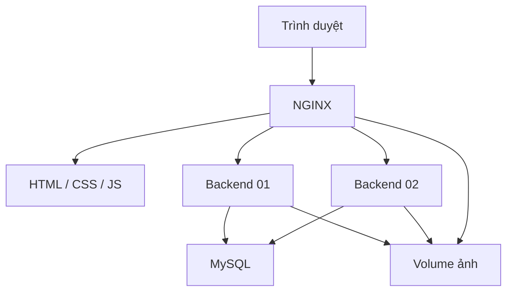

# Luma Store

Ứng dụng nhỏ để quản lý sản phẩm và kho hàng, dùng làm tình huống thực tế cho buổi học **NGINX**.

Người dùng tìm sản phẩm, sửa thông tin/ảnh và tạo phiếu nhập/xuất. Phần trình diễn kỹ thuật nằm ở trang riêng. Frontend không cần build; backend chia theo nghiệp vụ, dễ lần theo luồng xử lý.

## Chạy ứng dụng

Cần Docker Desktop đang chạy hoặc Docker Engine + Compose v2. Lần đầu cần Internet để tải image và các gói npm.

Giải nén, mở terminal tại thư mục **luma-store**, rồi chạy:

**Linux / macOS / WSL**

```bash
bash scripts/demo.sh up
```

**Windows PowerShell**

```powershell
powershell -ExecutionPolicy Bypass -File .\scripts\demo.ps1 up
```

Script tự tạo `.env` từ `.env.example`, build hai backend, đợi MySQL và kiểm tra NGINX.

- Cửa hàng: [http://localhost:8080](http://localhost:8080)
- Trang demo: [http://localhost:8080/demo.html](http://localhost:8080/demo.html)
- Mặc định: hai backend, giới hạn request body tại NGINX **20M**.

Có thể sửa các cổng trong `.env` trước khi chạy. Frontend và API đi qua cùng NGINX; URL trong frontend dùng đường dẫn tương đối nên không phải sửa khi đổi cổng.

## Luồng sử dụng

| Màn hình | Việc người dùng thực hiện |
|---|---|
| Tổng quan | Xem số sản phẩm, lượng tồn, giá trị hàng tồn theo giá bán, hàng cần bổ sung và phiếu gần đây |
| Sản phẩm | Tìm tên/SKU, lọc danh mục/tồn/trạng thái, sắp xếp, phân trang, xem bảng hoặc thẻ |
| Biểu mẫu sản phẩm | Thêm/sửa thông tin, chọn ảnh, đặt ngưỡng cảnh báo, ngừng hoặc khôi phục kinh doanh |
| Kho hàng | Nhập/xuất theo sản phẩm; xem lịch sử, tồn trước và sau mỗi phiếu |
| Trình diễn NGINX | Quan sát backend trả lời, header proxy, HTTP 413, failover và HTTPS |

Có **12 sản phẩm mẫu, 4 danh mục** và lịch sử tồn đầu kỳ. Các chỉ số tổng quan được tính từ dữ liệu đang có. “Giá trị hàng tồn” là `giá bán × tồn kho`, không phải doanh thu hoặc giá vốn.

Khi sửa sản phẩm, tồn kho được điều chỉnh qua phiếu riêng. API chặn xuất quá tồn, SKU trùng, dữ liệu sai và ảnh không hợp lệ.

## Công nghệ và kiến trúc

- **Frontend:** HTML, CSS, JavaScript ES modules; không cần framework hoặc công cụ build.
- **Backend:** Node.js 24, Express 5, MySQL2, Multer, Sharp.
- **Dữ liệu:** MySQL 8.4; hai backend dùng chung database và volume ảnh.
- **NGINX:** phục vụ frontend/ảnh, reverse proxy, upstream round robin và TLS.
- **Docker Compose:** NGINX, backend1, backend2, MySQL.



Luồng API: **Route → Controller → Validation → Service → Repository → MySQL**.

`src/app.js` chỉ nối các dependency. Controller đọc request/trả response; service chứa quy tắc; repository chứa SQL với tham số. Không đặt SQL và nghiệp vụ trong route.

## Các tệp nên đọc để trình bày

```text
luma-store/
├── frontend/
│   ├── index.html, styles.css       Giao diện cửa hàng
│   ├── demo.html, demo.css          Trang quan sát NGINX
│   ├── js/
│   │   ├── app.js                  Điều hướng
│   │   ├── api.js, ui.js            Gọi API, thành phần giao diện chung
│   │   ├── actions.js              Biểu mẫu sản phẩm và phiếu kho
│   │   ├── pages/                  Tổng quan, sản phẩm, kho hàng
│   │   └── demo.js                 Bộ đếm và header trình diễn
│   └── assets/                     Logo và ảnh minh họa SVG có sẵn
├── backend/src/
│   ├── app.js, server.js, config.js
│   ├── common/                     Lỗi, response, request ID và log
│   ├── database/                   Pool và transaction
│   ├── infrastructure/             Xử lý và lưu ảnh
│   └── modules/
│       ├── products/               route → controller → service → repository
│       ├── inventory/              Phiếu nhập/xuất
│       ├── overview/               Chỉ số tổng quan
│       └── system/                 Health và thông tin demo
├── mysql/init.sql                  Schema, danh mục và dữ liệu mẫu
├── nginx/stages/                   5 cấu hình để trình diễn
├── scripts/                        Chạy demo và kiểm tra
├── tests/image-fixture.mjs          Tạo ảnh PNG thật > 1 MB để kiểm tra
├── docs/                           Kiến trúc, API, kịch bản và kết quả kiểm tra
└── compose.yaml
```

Xem [kịch bản demo 10–12 phút](docs/DEMO.md), [kiến trúc và luồng xử lý](docs/ARCHITECTURE.md), [API](docs/API.md) và [kết quả kiểm tra](docs/VERIFICATION.md).

## Kiểm tra nhanh

Node.js 22 trở lên chỉ cần cho các lệnh kiểm tra trên máy host; ứng dụng vẫn chạy hoàn toàn bằng Docker.

```bash
node scripts/check.mjs
node scripts/smoke.mjs http://localhost:8080
```

Chạy smoke ở **stage 4**, với cả hai backend đang hoạt động. Script kiểm tra cả xuất kho đồng thời và ảnh lớn hơn 1 MB. Nó tạo một sản phẩm kiểm tra, rồi chuyển sản phẩm đó sang “Ngừng kinh doanh”; lịch sử được giữ để đối chiếu.

## Dừng và chạy lại

```bash
bash scripts/demo.sh down
bash scripts/demo.sh up
```

`down` giữ dữ liệu MySQL và ảnh. Docker chỉ chạy `init.sql` khi volume MySQL còn trống. Project Compose có tên riêng `luma-store-demo`, tách dữ liệu với bản demo trước.

Muốn **xóa toàn bộ dữ liệu của bản Luma Store để nạp lại mẫu**, dùng lệnh sau ở đúng thư mục project:

```bash
docker compose -f compose.yaml down -v
bash scripts/demo.sh up
```

## Nếu gặp lỗi

| Hiện tượng | Cách kiểm tra |
|---|---|
| Cổng 8080/8443/5001/5002 đang bận | Sửa cổng tương ứng trong `.env` rồi chạy lại `up` |
| API 503 ở stage 1 | Đây là bước demo static; chuyển stage 2 hoặc 4 để sử dụng cửa hàng |
| Ảnh >1 MB báo 413 ở stage 3 | Chuyển stage 4; NGINX sẽ cho request qua, API vẫn giới hạn mỗi ảnh 8 MB |
| Backend 02 chưa xuất hiện sau `start2` | Đợi backend khởi động và quá `fail_timeout=3s`, gọi thêm vài GET |
| MySQL chưa healthy | `docker compose logs --tail=60 mysql`; lần đầu có thể cần đợi thêm |
| Đổi thông tin MySQL trong `.env` nhưng vẫn lỗi | User/password của volume cũ không tự đổi theo env; dùng giá trị cũ hoặc khởi tạo lại dữ liệu demo |
| Cảnh báo chứng chỉ HTTPS | Chứng chỉ local tự ký; xem bước HTTPS trong `docs/DEMO.md` |

Phạm vi là ứng dụng quản lý nội bộ cho lớp học. Chưa có đăng nhập/phân quyền, đơn hàng hoặc triển khai Internet; có thể mở rộng sau khi hoàn tất buổi NGINX.
